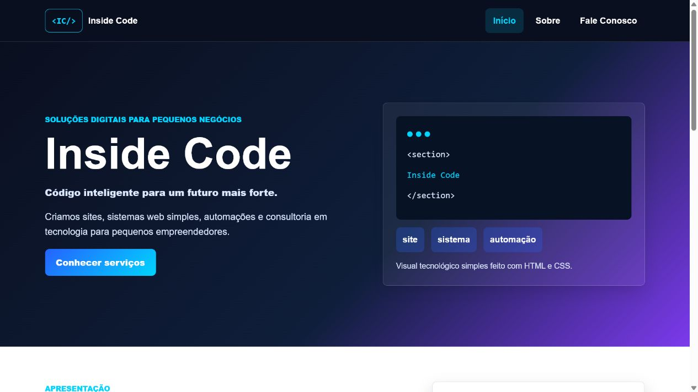
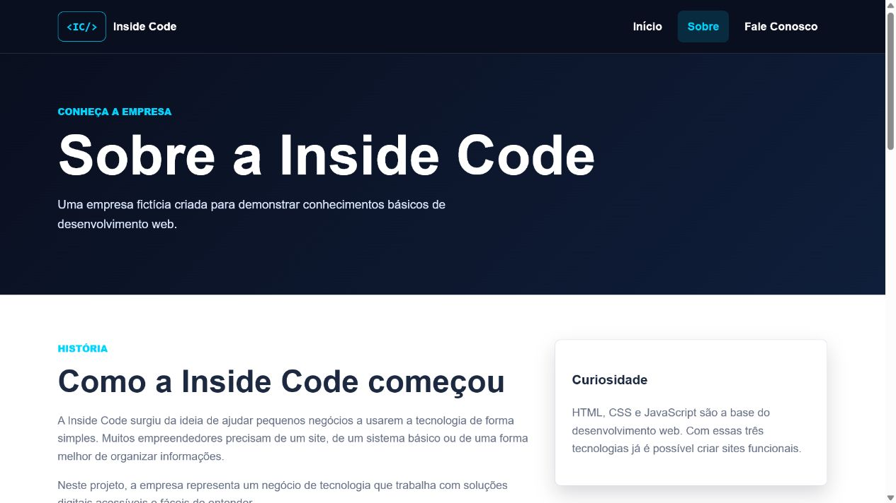
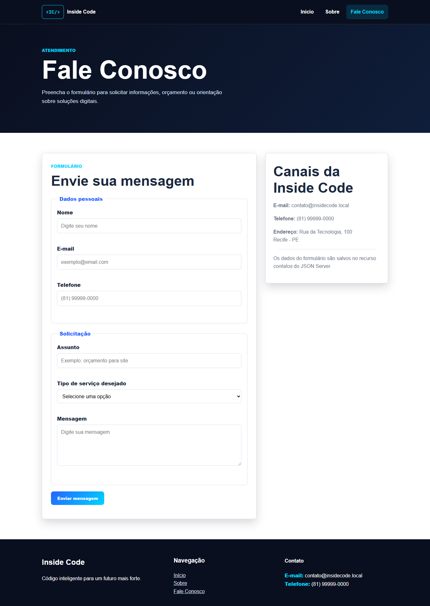
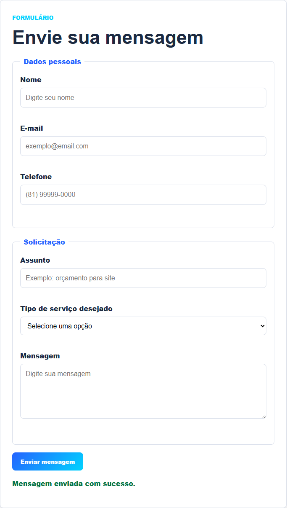
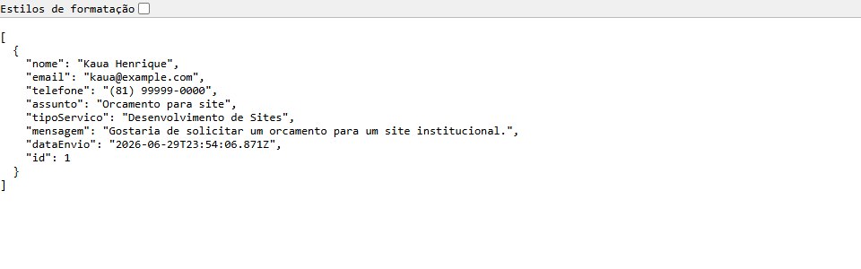

# Desenvolvimento de Site Institucional - Inside Code

## 1. Capa

Instituição: Faculdade Nova Roma

Curso: Análise e Desenvolvimento de Sistemas

Disciplina: Introdução ao Desenvolvimento Web

Professor: ______________________________

Aluno: Kauã Henrique de Jesus Santos Nascimento

Matrícula: ______________________________

Título: Desenvolvimento de Site Institucional - Inside Code

Data: Junho de 2026

## 2. Introdução

Este trabalho apresenta o desenvolvimento de um site institucional para a empresa fictícia Inside Code. A empresa escolhida atua na área de tecnologia e oferece soluções digitais para pequenos negócios, como desenvolvimento de sites, sistemas web simples, automação de processos e consultoria em tecnologia.

O problema que o site pretende solucionar é a falta de presença digital organizada de pequenos empreendedores. Muitas empresas pequenas precisam divulgar seus serviços e receber contatos de clientes, mas ainda não possuem um canal simples e profissional na internet.

O público-alvo da aplicação é formado por pequenos empresários, prestadores de serviço e empreendedores que desejam melhorar sua comunicação digital. O objetivo geral da aplicação é apresentar a empresa, divulgar seus serviços e permitir que clientes enviem mensagens pelo formulário Fale Conosco.

## 3. Descrição da Aplicação

A aplicação desenvolvida é um site institucional simples, bonito, funcional e responsivo. O sistema possui três páginas principais: Página Inicial, Sobre e Fale Conosco.

A Página Inicial apresenta o nome da empresa, logotipo em HTML/CSS, menu de navegação, área principal com visual tecnológico, apresentação da empresa, chamada para serviços, cards de serviços e diferenciais.

A página Sobre apresenta uma história fictícia da empresa, missão, visão, valores, tabela com informações gerais e um aside com destaque sobre tecnologia.

A página Fale Conosco possui formulário com os campos Nome, E-mail, Telefone, Assunto, Tipo de serviço desejado e Mensagem. Todos os campos são validados com JavaScript puro. Quando o formulário está correto, os dados são enviados ao JSON Server usando `fetch` com método `POST`.

As tecnologias utilizadas foram HTML5, CSS3, JavaScript puro e JSON Server.

## 4. Estrutura do Projeto

O projeto está organizado da seguinte forma:

```txt
inside-code/
|
|-- index.html
|-- sobre.html
|-- contato.html
|
|-- css/
|   |-- style.css
|
|-- js/
|   |-- script.js
|
|-- img/
|   |-- README.txt
|
|-- db.json
|-- README.md
```

O arquivo `index.html` contém a página inicial do site.

O arquivo `sobre.html` contém as informações institucionais da Inside Code.

O arquivo `contato.html` contém o formulário Fale Conosco.

O arquivo `css/style.css` contém toda a estilização visual do projeto.

O arquivo `js/script.js` contém a validação do formulário, a máscara simples de telefone e o envio dos dados para o JSON Server.

O arquivo `db.json` armazena os contatos enviados pelo formulário na lista `contatos`.

O arquivo `README.md` explica o objetivo do projeto, tecnologias utilizadas, forma de execução, estrutura de pastas, funcionalidades, autor e link do GitHub.

## 5. Capturas de Tela

Espaço para inserir print da Página Inicial:



Espaço para inserir print da Página Sobre:



Espaço para inserir print da Página Fale Conosco:



Espaço para inserir print do Formulário funcionando:



Espaço para inserir print dos Dados salvos no JSON Server:



## 6. Versionamento e GitHub

O projeto deve ser versionado utilizando Git e publicado em um repositório público no GitHub. O versionamento permite registrar as alterações realizadas, organizar o desenvolvimento e facilitar a entrega da atividade acadêmica.

Link do GitHub: https://github.com/Kauahenrique007/atividadeweb.git
